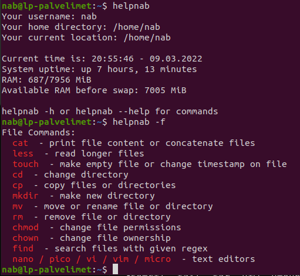

# Simple shell script for Linux Palvelimet -course



Without parameters print:
- username, 
- user's home directory 
- current working directory
- current time
- uptime
- free / used RAM
- available RAM

## Commands
```console
helpnab
helpnab [option]:
-a, -c, --commands 	show all commands in the list
-b, --basic 		show some basic commands
-f, --file 		show file commands
-i, --information	show information commands
-h, --help 		display this help and exit

-h, --h display help
	

